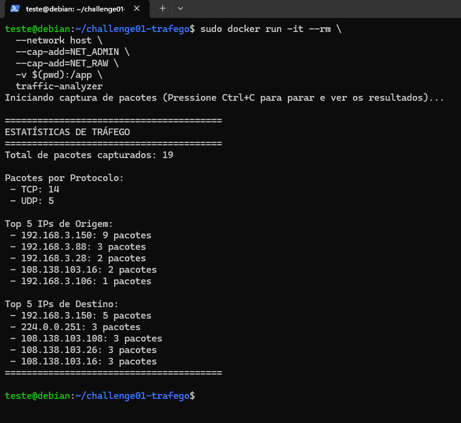

# Documentação - Challenge 01: Analisador de Tráfego de Rede

## 1. Visão Geral
Esta aplicação foi desenvolvida para realizar a captura de pacotes de uma interface de rede, analisar os dados capturados e exibir estatísticas consolidadas. A ferramenta extrai informações essenciais dos pacotes (IP de origem, IP de destino, protocolo e tamanho), armazena esses dados de forma persistente em um banco de dados e apresenta um relatório estatístico ao final da execução. O ambiente é totalmente conteinerizado utilizando Docker para garantir portabilidade e isolamento.

## 2. Decisões de Arquitetura e Tecnologias
Para atender aos requisitos do desafio de forma eficiente e sustentável, as seguintes tecnologias e abordagens foram escolhidas:

* **Linguagem (Python):** Escolhida por possuir um ecossistema nativo rico para manipulação de redes e automação.
* **Biblioteca de Captura (Scapy):** O Scapy (`scapy==2.5.0`) foi utilizado por ser a ferramenta mais robusta no ecossistema Python para captura (*sniffing*) e decodificação de pacotes, permitindo a extração fácil das camadas IP, TCP e UDP.
* **Banco de Dados (SQLite):** A escolha do SQLite justifica-se por ser um banco de dados relacional leve e sem servidor (*serverless*). Isso elimina a necessidade de subir e configurar um contêiner adicional apenas para o banco de dados (como PostgreSQL ou MySQL), mantendo a arquitetura simples, rápida e aderente ao escopo do desafio.
* **Conteinerização (Docker):** A aplicação roda dentro de um contêiner baseado na imagem `python:3.9-slim`, garantindo que dependências de sistema operacional (como `libpcap-dev`) fiquem isoladas da máquina hospedeira.

### Schema da Base de Dados
O banco de dados `packets.db` é inicializado automaticamente e contém uma única tabela principal chamada `traffic`.

| Coluna | Tipo | Descrição |
| :--- | :--- | :--- |
| `id` | INTEGER | Chave primária (Primary Key) com autoincremento. |
| `src_ip` | TEXT | Endereço IP de origem do pacote. |
| `dst_ip` | TEXT | Endereço IP de destino do pacote. |
| `protocol` | TEXT | Protocolo da camada de transporte (TCP, UDP ou OTHER). |
| `size` | INTEGER | Tamanho total do pacote capturado em bytes. |

## 3. Como Configurar e Executar

### Pré-requisitos
* Sistema Operacional Linux (ex: Debian/Ubuntu).
* Docker instalado e rodando.
* Acesso de superusuário (`sudo`) para permitir que o contêiner acesse a placa de rede em modo promíscuo.

### Passo 1: Construção da Imagem
No diretório onde se encontram os arquivos `Dockerfile`, `analyzer.py` e `requirements.txt`, execute o comando de *build*:
```bash
sudo docker build -t traffic-analyzer .

```

# Execução do Contêiner
Para iniciar a captura, execute o comando abaixo. O mapeamento do volume (-v) é utilizado
para garantir que o banco de dados gerado seja salvo na maquina hospedeira. As capabilities de rede
são necessárias para que o Scapy funcione dentro do Docker.

```bash
sudo docker run -it --rm \
  --network host \
  --cap-add=NET_ADMIN \
  --cap-add=NET_RAW \
  -v $(pwd):/app \
  traffic-analyzer
  ```

  A captura rida por 60 segundos por padrão, ou até que o usuário interrompa manualmente usando Ctrl+C.

  # Evidência da execução e resultados

  Iniciando captura de pacotes (Pressione Ctrl+C para parar e ver os resultados)...

========================================
ESTATÍSTICAS DE TRÁFEGO
========================================
Total de pacotes capturados: 19

Pacotes por Protocolo:
 - TCP: 14
 - UDP: 5

Top 5 IPs de Origem:
 - 192.168.3.150: 9 pacotes
 - 192.168.3.88: 3 pacotes
 - 192.168.3.28: 2 pacotes
 - 108.138.103.16: 2 pacotes
 - 192.168.3.106: 1 pacotes

Top 5 IPs de Destino:
 - 192.168.3.150: 5 pacotes
 - 224.0.0.251: 3 pacotes
 - 108.138.103.108: 3 pacotes
 - 108.138.103.26: 3 pacotes
 - 108.138.103.16: 3 pacotes
========================================

Após a execução, os dados brutos desses pacotes ficam disponíveis para consulta no arquivo packets.db gerado no diretório atual.

